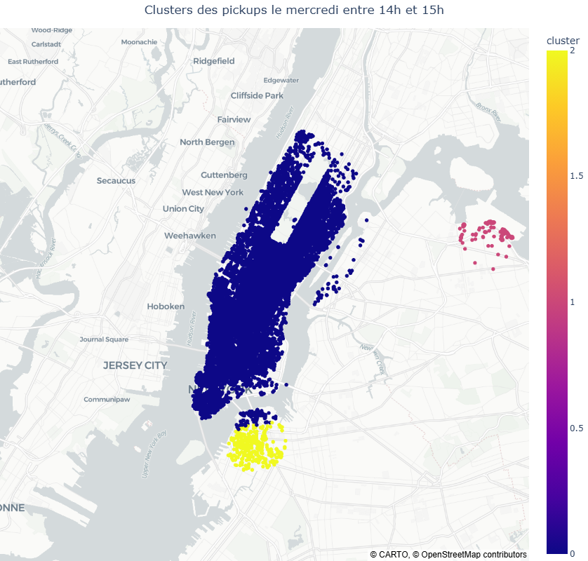
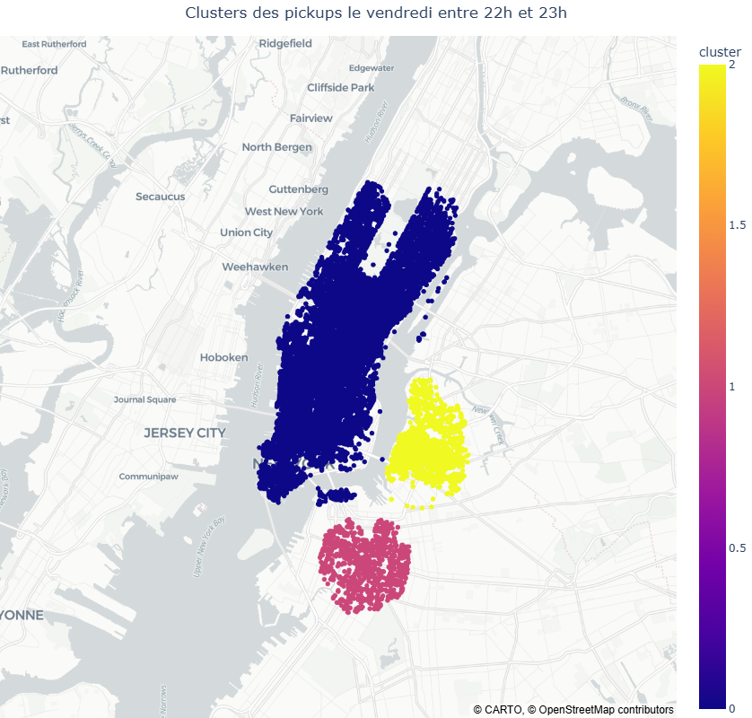

# 🗺️ Uber Hot-Zones Detection with Adaptive DBSCAN

**Self-tuning geospatial clustering system for driver positioning optimization in NYC**

[](https://www.python.org/)
[](https://scikit-learn.org/)

---

## 🎯 Problem & Solution

**The Challenge**: Uber drivers often position themselves in low-demand areas, leading to 10-15 minute wait times and user cancellations when wait exceeds 5-7 minutes.

**The Solution**: Automated detection of high-demand zones for any day/hour combination, enabling data-driven positioning recommendations.

---

## 📊 Key Achievements

| Metric | Value |
|--------|-------|
| **Dataset processed** | 4.5M pickups (April-September 2014) |
| **Time windows analyzed** | 168 (7 days × 24 hours) |
| **Clusters detected per slot** | 3+ (adaptive to demand density) |
| **Outliers filtered** | ~15-20% for clearer zone identification |
| **Total processing time** | 2 hours |
| **Automation level** | Fully automated hyperparameter tuning |

<div align="center">
  
  
  <p><i>Example: Thursday afternoon vs Friday night demand patterns</i></p>
</div>

---

## 🔬 Technical Approach

### Automated DBSCAN Hyperparameter Tuning

The key innovation is **fully automated parameter optimization** that adapts to data density without manual intervention:

#### 🎯 Epsilon Estimation (neighborhood radius)
- **Method**: K-distance analysis using NearestNeighbors
- **Formula**: ε = percentile(k-distances) where percentile = min(96, 70 + 0.002 × n_samples)
- **Logic**: Ensures 70-96% of points have sufficient neighbors for clustering

#### 🔢 Min_samples Calculation (minimum cluster size)
- **Formula**: min_samples = max(10, 1.5% of observations)
- **Adaptive scaling**: Low-traffic hours → 10 points minimum, Rush hours → 100+ points
- **Purpose**: Prevents micro-clusters while adapting to data volume

#### 🔄 Convergence Loop
- **Target**: Minimum 3 distinct clusters per time window
- **Strategy**: If insufficient clusters, decrease percentile by 3 and retry
- **Safety**: Flags error if percentile drops below 45 (no valid solution exists)

### Algorithm Comparison: Why DBSCAN?

Empirical evaluation on Monday 8-9 AM data (3,018 pickups):

| Criterion | KMeans | DBSCAN |
|-----------|--------|---------|
| **Cluster count** | Manual selection (elbow + silhouette) | Automatic detection |
| **Outlier handling** | Forces all points into clusters | Filters ~15-20% noise |
| **Geographic coherence** | Splits natural zones arbitrarily | Respects spatial continuity |
| **Reproducibility** | Subjective k choice | Algorithmic parameter tuning |

**Verdict**: DBSCAN selected for automatic adaptation to density variations and cleaner zone identification through outlier removal.

---

## 🏗️ Methodology

### Data Pipeline

**1. Preprocessing**
- Outlier removal: ±3σ filter on coordinates
- Temporal decomposition: Extract weekday + hour
- Dataset splitting: 168 time windows (7 days × 24 hours)

**2. Clustering Workflow**
```
For each time window:
  → Standardize coordinates (zero mean, unit variance)
  → Estimate epsilon via k-distance percentile
  → Run DBSCAN with adaptive min_samples
  → Validate cluster count (≥3 required)
  → Export results to CSV
```

**3. Reusable Functions**
- `estimate_eps()` → Automatic epsilon calculation
- `get_hot_zones(day, hour)` → Complete clustering pipeline
- `get_map(day, hour)` → Interactive visualization generator

---

## 📁 Repository Structure

```
uber-pickups-hot-zones-detection/
├── uber_pickups.ipynb          # Analysis notebook with full pipeline
├── requirements.txt            # Dependencies
├── data/                       # Raw pickup data (Apr-Sep 2014)
├── hot_zones/                  # Generated results (168 CSV files)
│   ├── lundi/                  # Monday (0_1.csv to 23_24.csv)
│   ├── mardi/                  # Tuesday
│   └── ...
└── maps/                       # Sample visualizations
```

---

## 🚀 Quick Start

### Installation

```bash
# Clone repository
git clone https://github.com/JulienRouillard/uber-pickups-hot-zones-detection.git
cd uber-pickups-hot-zones-detection

# Install dependencies
pip install -r requirements.txt

# Launch notebook
jupyter notebook uber_pickups.ipynb
```

### Usage

**Visualize existing hot-zones:**
```python
get_map('lundi', 8)      # Monday 8-9 AM
get_map('vendredi', 18)  # Friday 6-7 PM
```

**Regenerate all clusters** (⚠️ ~120 min):
```python
for time in data_splited.keys():
    get_hot_zones(day=time[0], hour=time[1])
```

---

## 💻 Tech Stack

| Category | Tools |
|----------|-------|
| **Language** | Python 3.10+ |
| **ML/Clustering** | scikit-learn (DBSCAN, KMeans, NearestNeighbors) |
| **Data Processing** | pandas, numpy |
| **Geospatial** | geopandas, shapely |
| **Visualization** | plotly, matplotlib, contextily |

---

## 🎓 Skills Demonstrated

**Technical Competencies:**
- Unsupervised learning with density-based clustering
- Automated hyperparameter tuning (k-distance method)
- Geospatial data processing at scale (4.5M coordinates)
- Algorithm comparison and selection methodology

**Business Impact:**
- Clear, actionable zone recommendations for drivers
- Temporal granularity for hour-by-hour strategy


---

## 📧 Contact

**Julien Rouillard**  
Data Science | Machine Learning Engineering  
📫 julien.rouillard@yahoo.fr  
💼 [LinkedIn](https://linkedin.com/in/julien-rouillard) | 🐙 [GitHub](https://github.com/JulienRouillard)
